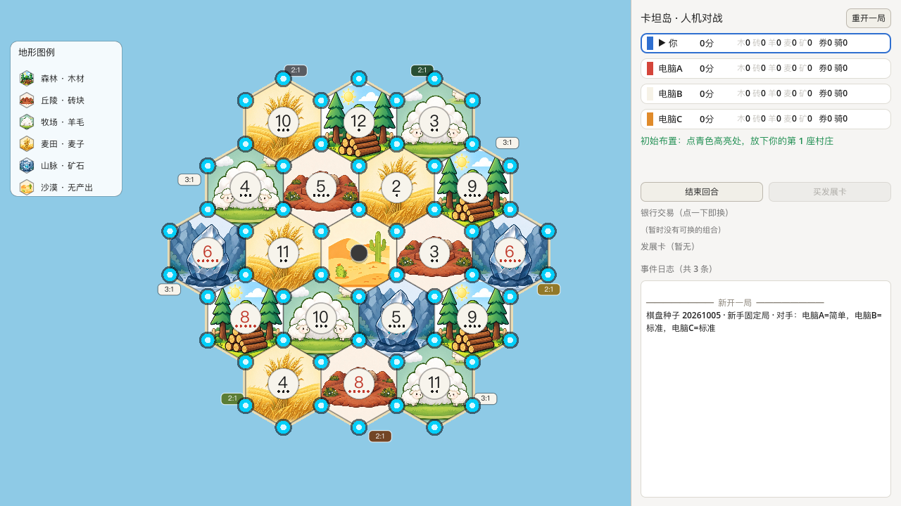
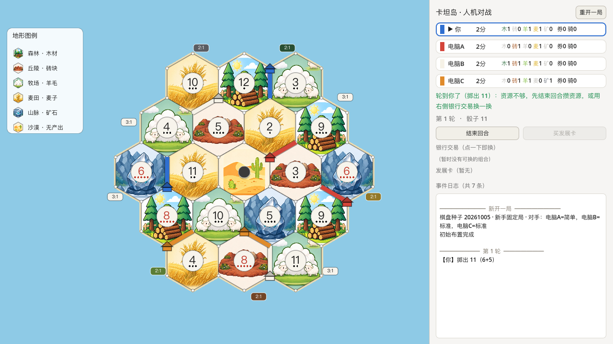
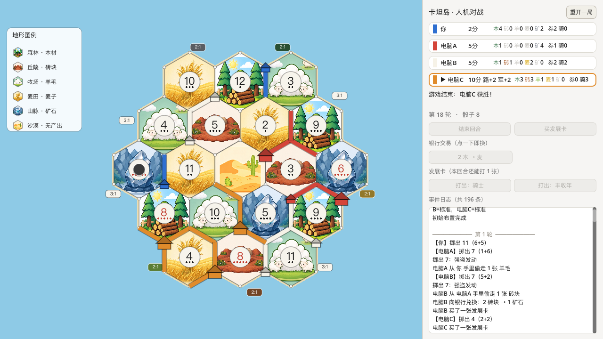

# Catan — Godot Human vs. AI

A single-player implementation of **Catan (base game)** built with **Godot 4.7 / GDScript**.
You play against 2–3 AI opponents in three difficulty tiers. No networking, no external dependencies.

[中文说明 →](README.zh-CN.md)



---

## Highlights

- **Rules engine fully decoupled from the renderer.** Everything under `core/` is `RefCounted` with no
  node or UI dependency, so tens of thousands of games can be simulated headlessly. AI strength is
  verified by win-rate matrices, not by vibes.
- **Three genuinely different AI tiers.** The difficulty gap comes from decision quality — scoring noise,
  look-ahead, threat blocking, trade evaluation, robber targeting, discard arithmetic — not from
  tweaking a number in a config.
- **One code path for humans and AI.** Both implement the same `IntentProvider` interface, so the
  interactive game and the batch harness can never drift apart.
- **Official board generation rules.** 6 and 8 are never adjacent, and no two adjacent hexes share a
  number — exactly as the official Almanac requires (and nothing more).
- **A real, playable UI**: hand-painted hex board with terrain artwork, click-to-build with legality
  highlighting, bank trading, development cards, a full untruncated event log, and a restart panel with
  seed control.

| Setup phase | Mid-game | Game over |
|---|---|---|
|  |  |  |

---

## Features

| Area | Implemented |
|---|---|
| Players | 1 human + 3 AI (difficulty per seat), 5–6 player extension slot reserved |
| Board | 19 hexes (forest / hills / pasture / fields / mountains / desert), 54 vertices, 72 edges |
| Resources | Wood, brick, wool, grain, ore |
| Building | Roads, settlements, cities, development cards |
| Bonus points | Longest road (+2), largest army (+2) |
| Mechanics | Robber & stealing, discard on 7, maritime trade (3:1 / 2:1 ports), domestic trade |
| Victory | First to 10 victory points on your own turn |
| UI | Terrain-illustrated board, click-to-build, legality + affordability highlighting, bank trade grid, dev card panel, full event log, restart dialog with seed |
| Tooling | Geometry assertions, rule unit tests, batch simulation, seed tests, render screenshots, simulated-click acceptance test |

**Not implemented yet** (see [Status](#status)): player-to-player trade UI, choosing for
discard / monopoly / year-of-plenty, animations and sound, tutorial, save/load, settings page.

---

## Requirements

- **Godot 4.7** (developed against 4.7.2 stable). Standard build — no modules or addons required.
- The `gl_compatibility` renderer is used, so it runs on integrated GPUs and older hardware.

---

## Getting started

```bash
git clone git@github.com:priece/godot-catan.git
cd godot-catan
```

Open the project in Godot (import `project.godot`), then press **F5** — the main scene is already set
as `run/main_scene`, so nothing else is needed.

From the terminal instead:

```bash
# macOS
/Applications/Godot.app/Contents/MacOS/Godot --path .

# Linux / Windows
godot --path .
```

The first launch may take a moment while Godot imports the terrain textures.

---

## How to play

**Setup phase.** Place two settlements and two roads. Legal spots are highlighted; click a highlighted
vertex to place a settlement, then a highlighted edge for the road.

**On your turn.** The game rolls the dice automatically. Then you can:

| Action | How |
|---|---|
| Build a road | Click a highlighted edge |
| Build a settlement | Click a highlighted vertex |
| Upgrade to a city | Click one of your existing settlements |
| Buy a development card | **买发展卡** button |
| Play a development card | **发展卡** panel — click a card's button |
| Trade with the bank / a port | **银行交易** grid — one click performs the exchange |
| End your turn | **结束回合** button |
| Move the robber | When you roll a 7 or play a Knight, click the target hex |
| Restart with a new board | **重开一局** → type or pick a seed → **确定** |

The panel on the right lists every player's name, victory points, resource counts and current status,
followed by the **event log**. The log is never truncated — every event since the session started is
kept, and the title shows the running total.

**Notes.** Cyan outlines mark legal *and affordable* placements (legality alone is not enough — you may
not be able to pay). Press **Esc** to close the restart dialog. The restart dialog accepts digits only:
type a seed and press Enter or click **确定**, or use **随机一局** / **沿用本局** for the two shortcuts.

---

## AI opponents

Three tiers, freely mixable across seats. The differences are behavioural, not numeric:

| Decision | Easy | Medium | Hard |
|---|---|---|---|
| Initial placement | Score + heavy noise, 20% fully random | Best pure score | Score + blocking opponents + ports + look-ahead |
| Build priority | Random among affordable | VP efficiency: city > settlement > dev card > road | Multi-step planning, commits to longest road / largest army |
| Resource management | — | Keeps construction balance | Computes exact shortfalls, reserves for the endgame push |
| Domestic trade | 50% random accept | Evaluates equivalence, accepts profitable trades | Actively seeks arbitrage, never feeds the leader |
| Robber placement | Random hex | Opponent's high-production hex | Hits the leader, blocks their key number |
| Steal target | Random | Player with the most cards | Highest-scoring / suspected hoarder |
| Discard | Arbitrary | Dumps the least needed | Preserves construction combos |

Hard AI also picks a **winning strategy each turn** — road rush (longest road is the most common
winning path), development-card rush, or expansion (the timing of your 3rd settlement correlates most
strongly with victory) — and revises it as opponents claim bonuses.

Because the rules engine runs headlessly, AI strength is measured:

```bash
/Applications/Godot.app/Contents/MacOS/Godot --headless --path . --script res://tools/sim_runner.gd -- 500
```

This prints a win-rate matrix by difficulty and asserts two invariants for every game: resource
conservation (bank + all players = 19 cards per resource) and state integrity.

---

## Board generation

Generation follows the **official CATAN Almanac** ("Number Tokens – Fully-Random"):

- Terrain hexes are **shuffled and placed at random** — the official rulebook imposes no adjacency
  restriction on terrain or resources.
- **6 and 8 are never adjacent.** Both are 5-pip numbers; adjacent reds create a production corner that
  decides games in the first three rounds. This holds in every mode.
- **No two adjacent hexes share a number** (balanced mode).

Generation uses rejection sampling and **fails loudly** (`push_error`) rather than silently emitting an
invalid board. The rule is additionally asserted by `Board.self_check()` — which every simulated game
calls — and by `tools/test_seed.gd`.

Boards are deterministic: the same seed always yields the same island. Set the seed in the restart
dialog, or the `seed_value` export on `BoardView` / `GameDirector` in the inspector.

---

## Project structure

```
core/     Pure logic — no Node/UI dependency, headless-runnable
          hex_grid.gd · board_topology.gd · board.gd · game_state.gd · player_state.gd
          game_controller.gd · rules.gd · longest_road.gd · resources.gd
ai/       ai_base.gd · evaluation.gd · ai_easy.gd · ai_medium.gd · ai_hard.gd
game/     game_director.gd (turn/interaction orchestration) · intent_provider.gd · human_intent.gd
ui/       board_view.gd (_draw() board) · hud.gd (code-built panel) · palette.gd
scenes/   main.tscn
tools/    13 CLI scripts: tests, batch simulation, screenshots
assets/   terrain/ (used) · resource.src/ (originals, not imported)
docs/     preview and gameplay screenshots
```

### Verification tools

| Script | Headless? | Purpose |
|---|---|---|
| `verify_topology.gd` | yes | Asserts 19 hexes / 54 vertices / 72 edges and the degree distributions |
| `test_rules.gd` | yes | 46 rule unit tests |
| `test_seed.gd` | yes | Seed parsing + the official number-placement rules |
| `test_pick.gd` | yes | Touch picking: a tap inside a highlighted vertex must never fire a road |
| `test_trade_dialog.gd` | yes | Bank-trade dialog unit tests |
| `test_dev_dialog.gd` | yes | Dev-card / turn-split unit tests |
| `sim_runner.gd` | yes | Batch games, win-rate matrix, conservation invariants |
| `screenshot.gd` | **no** | Renders the board to a PNG with a self-check |
| `shot_dialog.gd` | **no** | Drives the restart dialog and captures it |
| `shot_trade_dialog.gd` | **no** | Captures the bank-trade dialog |
| `shot_dev_dialog.gd` | **no** | Captures the dev-card dialog |
| `test_interaction.gd` | **no** | Simulates human clicks through a full game (M2 acceptance) |

```bash
GODOT=/Applications/Godot.app/Contents/MacOS/Godot

$GODOT --headless --path . --script res://tools/verify_topology.gd
$GODOT --headless --path . --script res://tools/test_rules.gd
$GODOT --headless --path . --script res://tools/test_seed.gd
$GODOT --headless --path . --script res://tools/test_pick.gd
$GODOT --headless --path . --script res://tools/sim_runner.gd -- 500

# These must NOT be run with --headless, and need --resolution 1280x720
$GODOT --path . --resolution 1280x720 --script res://tools/test_interaction.gd -- 6000
$GODOT --path . --resolution 1280x720 --script res://tools/shot_dialog.gd
$GODOT --path . --resolution 1280x720 --script res://tools/screenshot.gd -- \
    res://scenes/main.tscn /tmp/board.png 30 auto
```

If you are an AI agent or a new contributor, read **[AGENTS.md](AGENTS.md)** first — it documents the
architecture contract, the conventions, and a list of Godot-specific traps that have already caused
real bugs here (silent theme-override failures, `text_changed` not firing on programmatic assignment,
`--resolution` not changing the viewport, `frame_post_draw` hanging under `--headless`, and more).

---

## Status

**Done**: P0 scaffolding · P1 board topology · P2 rules engine · P3 three AI tiers · P4 board rendering ·
P5 player interaction.

**Milestones reached**: **M1** — the rules engine (batch-simulated without illegal states) and
**M2** — a human playing a complete game against three AIs.

**Planned (M3)**: player-to-player trading UI, letting the human choose for discard / monopoly /
year-of-plenty, animations and sound effects, tutorial, save & replay, settings page.

Full design document and acceptance data: **[DESIGN.md](DESIGN.md)** (Chinese).

---

## License

No license file has been added yet, so this repository is currently **all rights reserved** by default.
If you intend to reuse it, please open an issue to discuss.

*Catan is a trademark of CATAN GmbH. This is an unofficial, non-commercial fan project.*
